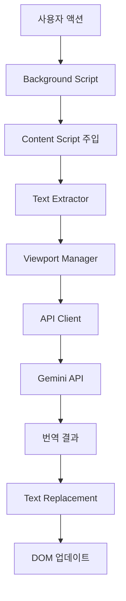

# 시스템 아키텍처

## 전체 구조

```
llm-translate2/
├── manifest.json                 # Firefox 애드온 설정
├── background/
│   └── background.js            # 백그라운드 스크립트
├── content/
│   ├── textExtractor.js         # 텍스트 추출 엔진
│   └── contentScript.js         # 페이지 주입 스크립트
├── icons/
│   └── icon-128.png            # 애드온 아이콘
├── test-pages/
│   └── index.html              # 테스트 페이지
└── docs/                       # 프로젝트 문서
```

## 컴포넌트 구조

### 1. Background Script
- **역할**: 애드온의 중앙 제어 허브
- **기능**:
  - 컨텍스트 메뉴 관리
  - Content Script 주입
  - 메시지 라우팅
  - API 호출 관리 (향후)

### 2. TextExtractor
- **역할**: 우선순위 기반 텍스트 추출 엔진
- **기능**:
  - HTML 요소 분석 및 분류
  - 텍스트 필터링 및 검증
  - 우선순위 기반 추출

### 3. ContentScript
- **역할**: 웹 페이지와의 인터페이스
- **기능**:
  - TextExtractor 관리
  - Background와 메시지 통신
  - 추출 결과 처리

## 데이터 흐름

```
사용자 액션 (우클릭)
    ↓
Background Script (컨텍스트 메뉴)
    ↓
Content Script 주입
    ↓
TextExtractor 초기화
    ↓
텍스트 추출 실행
    ↓
결과 콘솔 출력
    ↓
[향후] 번역 API 호출
```

## 우선순위 시스템

### High Priority
- `title`, `h1`, `h2`, `h3`, `main`, `article`
- 페이지의 핵심 콘텐츠

### Medium Priority  
- `h4`, `h5`, `h6`, `p`, `section`, `header`, `nav`
- 보조 정보 및 네비게이션

### Low Priority
- `div`, `span`, `li`, `td`, `th`, `figcaption`
- 세부 정보 및 장식적 요소

## 텍스트 필터링 규칙

### 제외 대상
- 숫자만 포함된 텍스트
- 특수문자만 포함된 텍스트  
- 한글이 이미 포함된 텍스트
- 2글자 미만의 짧은 텍스트
- 단어 하나만 있는 텍스트 (10글자 미만)

### 제외 요소
- `SCRIPT`, `STYLE`, `NOSCRIPT`, `CODE`, `PRE`
- `notranslate`, `translate-no` 클래스

## 확장성 설계

### 모듈화
- 각 기능별로 독립적인 클래스 구성
- 인터페이스 기반 통신

### 설정 가능성
- 우선순위 태그 설정 가능
- 필터링 규칙 커스터마이징 가능
- API 제공자 변경 가능 (향후)

### 성능 최적화
- IntersectionObserver 활용 (향후)
- Debounce 패턴 적용 (향후)
- 배치 처리 지원 (향후)

## 🔧 컴포넌트 아키텍처

### 1. Background Script Layer
```
background.js
├── Context Menu Manager
│   ├── 메뉴 항목 생성 및 관리
│   └── 사용자 액션 감지
├── Script Injection Controller
│   ├── content script 동적 주입
│   └── 탭별 상태 관리
└── Storage Manager
    ├── 사용자 설정 관리
    └── API 키 보안 저장
```

### 2. Content Script Layer
```
Content Scripts
├── translator.js (Main Controller)
│   ├── 번역 프로세스 orchestration
│   ├── 모듈 간 통신 관리
│   └── 상태 관리 (번역 진행, 완료 등)
├── textExtractor.js (Text Processing)
│   ├── DOM 순회 및 텍스트 노드 추출
│   ├── HTML 구조 보존 텍스트 교체
│   └── 필터링 (script, style 등 제외)
├── viewportManager.js (Viewport Control)
│   ├── IntersectionObserver 관리
│   ├── 가시 영역 텍스트 우선순위 처리
│   └── 스크롤 기반 동적 로딩
├── apiClient.js (API Communication)
│   ├── Gemini API 호출 관리
│   ├── 배치 처리 및 에러 핸들링
│   └── 응답 파싱 및 검증
└── debouncer.js (Event Optimization)
    ├── 스크롤 이벤트 debounce
    ├── 리사이즈 이벤트 throttle
    └── 성능 최적화 유틸리티
```

### 3. User Interface Layer
```
UI Components
├── Options Page
│   ├── API 키 설정 인터페이스
│   ├── 번역 옵션 관리
│   └── 사용 통계 표시
└── Popup Interface
    ├── 번역 상태 표시
    ├── 빠른 토글 컨트롤
    └── 진행률 표시
```

## 🔄 데이터 흐름 아키텍처

### 1. 번역 프로세스 플로우


### 2. 모듈 간 의존성
```
Dependencies Flow:
translator.js
├── depends on → textExtractor.js
├── depends on → viewportManager.js
├── depends on → apiClient.js
└── depends on → debouncer.js

viewportManager.js
├── depends on → textExtractor.js
└── depends on → debouncer.js

apiClient.js
├── depends on → storage (background)
└── depends on → error handling utils
```

## 🔌 API 통신 아키텍처

### 1. 메시지 패싱 구조
```javascript
// Background ↔ Content Script 통신
{
  type: 'TRANSLATE_PAGE',
  data: {
    apiKey: 'encrypted_key',
    options: { targetLang: 'ko', sourceDetection: true }
  }
}

// Content Script 내부 모듈 통신
{
  type: 'TEXT_EXTRACTED',
  payload: {
    textNodes: [...],
    priority: 'viewport' | 'background'
  }
}

// API 통신 구조
{
  method: 'POST',
  endpoint: '/v1/models/gemini-pro:generateContent',
  data: {
    contents: [{ parts: [{ text: batchedTexts }] }],
    generationConfig: { temperature: 0.1 }
  }
}
```

### 2. 상태 관리 아키텍처
```javascript
// 전역 상태 구조
const TranslationState = {
  isActive: boolean,
  progress: {
    total: number,
    completed: number,
    failed: number
  },
  queue: {
    viewport: TextNode[],
    background: TextNode[]
  },
  cache: Map<string, string>,
  config: {
    apiKey: string,
    batchSize: number,
    debounceDelay: number
  }
};
```

## 🎯 성능 최적화 아키텍처

### 1. 텍스트 처리 최적화
- **Tree Walking Algorithm**: 효율적인 DOM 순회
- **Priority Queue**: 뷰포트 우선 처리
- **Batch Processing**: API 호출 최적화
- **Memory Pool**: 객체 재사용으로 GC 최소화

### 2. 네트워크 최적화
- **Request Batching**: 여러 텍스트를 하나의 요청으로 처리
- **Response Caching**: 동일한 텍스트 재번역 방지
- **Retry Logic**: 실패한 요청에 대한 지수 백오프
- **Rate Limiting**: API 사용량 제한 준수

### 3. 렌더링 최적화
- **Intersection Observer**: 뷰포트 기반 lazy loading
- **Document Fragment**: DOM 조작 최소화
- **Debounced Events**: 스크롤/리사이즈 이벤트 최적화
- **Virtual Scrolling**: 대용량 페이지 처리

## 🔐 보안 아키텍처

### 1. 데이터 보호
```
Security Layers:
├── API Key Encryption
│   ├── Chrome Storage API 암호화
│   └── 메모리 내 키 최소 보관
├── Content Security Policy
│   ├── XSS 방지 정책
│   └── 외부 리소스 제한
└── Permission Management
    ├── 최소 권한 원칙
    └── 동적 권한 요청
```

### 2. 통신 보안
- **HTTPS Only**: 모든 API 통신 암호화
- **Input Sanitization**: 사용자 입력 검증
- **Output Encoding**: 번역 결과 안전한 렌더링
- **Origin Validation**: 메시지 송신자 검증

## 🧪 테스트 아키텍처

### 1. 테스트 계층 구조
```
Testing Strategy:
├── Unit Tests
│   ├── textExtractor.test.js
│   ├── apiClient.test.js
│   └── viewportManager.test.js
├── Integration Tests
│   ├── background-content communication
│   └── API integration tests
└── E2E Tests
    ├── 실제 웹사이트에서 번역 테스트
    └── 사용자 시나리오 기반 테스트
```

### 2. 모니터링 및 로깅
- **Performance Metrics**: 번역 속도, 메모리 사용량
- **Error Tracking**: API 오류, DOM 조작 실패
- **Usage Analytics**: 사용 패턴 분석 (개인정보 제외)
- **Debug Logging**: 개발 환경 디버깅 지원 